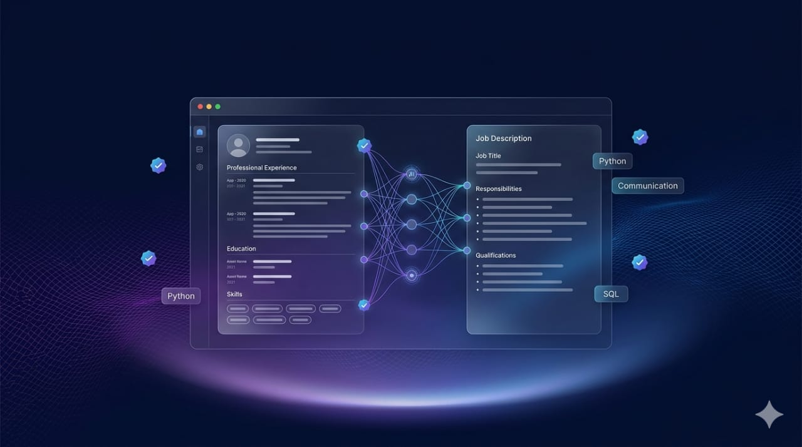

# SmartHire AI

An AI-powered recruitment platform that automates resume screening using OpenAI. HR teams post jobs, candidates apply, and AI instantly analyzes every resume — delivering results via email.



---

## Features

- **AI Resume Screening** — OpenAI analyzes every resume against job requirements automatically
- **ATS Scoring** — Each candidate gets a score (0–100) based on skills, experience, and education
- **Instant Email Results** — Candidates receive selection/rejection emails within minutes
- **HR Dashboard** — Manage all job postings and view applicants in one place
- **Unique Apply Links** — Share a unique link per job; no candidate account needed
- **Duplicate Prevention** — Same candidate cannot apply twice for the same position
- **Dark Professional UI** — Built with Next.js and Tailwind CSS

---

## Tech Stack

| Layer | Technology |
|---|---|
| Frontend | Next.js 14, React, Tailwind CSS |
| Backend | FastAPI (Python) |
| AI | OpenAI GPT-4o-mini |
| Database | Supabase (PostgreSQL) |
| Auth | Supabase Auth |
| Storage | Supabase Storage |
| Email | Gmail SMTP |

---

## Project Structure

```
SmartHire-AI/
├── frontend/          # Next.js app
│   ├── app/
│   │   ├── page.tsx              # Home page
│   │   ├── hr/
│   │   │   ├── login/            # HR login & signup
│   │   │   ├── dashboard/        # HR dashboard
│   │   │   ├── post-job/         # Create job posting
│   │   │   └── job/[id]/         # View applicants
│   │   └── apply/[jobId]/        # Candidate apply page
│   └── public/
│       └── home_page_img.jpeg
├── backend/           # FastAPI app
│   ├── main.py
│   ├── routes/
│   │   ├── jobs.py
│   │   ├── applications.py
│   │   └── hr.py
│   ├── agent/
│   │   └── resume_agent.py       # OpenAI resume analysis
│   ├── email_service.py
│   ├── supabase_client.py
│   ├── requirements.txt
│   └── Dockerfile
└── README.md
```

---

## Getting Started

### Prerequisites

- Node.js 18+
- Python 3.11+
- Supabase project
- OpenAI API key
- Gmail account with App Password

### 1. Clone the repository

```bash
git clone https://github.com/rubaahmedkhan/SmartHire-AI.git
cd SmartHire-AI
```

### 2. Supabase Setup

Run this SQL in your Supabase SQL Editor:

```sql
create table hr_users (
  id uuid primary key,
  name text not null,
  company_name text not null,
  email text not null,
  created_at timestamptz default now()
);

create table jobs (
  id uuid primary key default gen_random_uuid(),
  title text not null,
  company_name text not null,
  description text not null,
  required_skills text[] default '{}',
  experience_years int default 0,
  hr_id uuid,
  hr_email text,
  unique_link text unique,
  is_active boolean default true,
  created_at timestamptz default now()
);

create table applications (
  id uuid primary key,
  job_id uuid references jobs(id),
  candidate_name text not null,
  candidate_email text not null,
  resume_url text,
  status text default 'pending',
  ats_score int,
  missing_skills text[] default '{}',
  ai_feedback text,
  skill_recommendations text[] default '{}',
  applied_at timestamptz default now(),
  updated_at timestamptz
);

alter table hr_users disable row level security;
alter table jobs disable row level security;
alter table applications disable row level security;
```

Also create a Storage bucket named **`resumes`** (set to Public).

### 3. Backend Setup

```bash
cd backend
python -m venv venv
venv\Scripts\activate        # Windows
# source venv/bin/activate   # Mac/Linux

pip install -r requirements.txt
```

Create a `.env` file in the root directory:

```env
OPENAI_API_KEY=your_openai_api_key
SUPABASE_URL=https://your-project.supabase.co
SUPABASE_SERVICE_ROLE_KEY=your_service_role_key
SMTP_HOST=smtp.gmail.com
SMTP_PORT=587
SMTP_EMAIL=your@gmail.com
SMTP_APP_PASSWORD=your_app_password
NEXT_PUBLIC_SUPABASE_URL=https://your-project.supabase.co
NEXT_PUBLIC_SUPABASE_ANON_KEY=your_anon_key
NEXT_PUBLIC_API_URL=http://localhost:8000
```

Run the backend:

```bash
uvicorn main:app --reload
```

Backend runs on `http://localhost:8000`

### 4. Frontend Setup

```bash
cd frontend
npm install
```

Create `frontend/.env.local`:

```env
NEXT_PUBLIC_SUPABASE_URL=https://your-project.supabase.co
NEXT_PUBLIC_SUPABASE_ANON_KEY=your_anon_key
NEXT_PUBLIC_API_URL=http://localhost:8000
```

Run the frontend:

```bash
npm run dev
```

Frontend runs on `http://localhost:3000`

---

## How It Works

### For HR Teams
1. Sign up and log in to the HR portal
2. Create a job posting with title, description, required skills, and experience level
3. Share the unique application link with candidates
4. View all applicants and their AI scores on the dashboard

### For Candidates
1. Open the job link shared by HR
2. Fill in your name, email, and upload your resume (PDF)
3. AI analyzes your resume instantly
4. Receive your result via email within minutes

---

## Deployment

| Service | Platform |
|---|---|
| Frontend | [Vercel](https://vercel.com) |
| Backend | [Hugging Face Spaces](https://huggingface.co/spaces) |

### Environment Variables for Production

**Vercel (Frontend):**
```
NEXT_PUBLIC_SUPABASE_URL
NEXT_PUBLIC_SUPABASE_ANON_KEY
NEXT_PUBLIC_API_URL  →  https://your-hf-space.hf.space
```

**Hugging Face Spaces (Backend):**
```
OPENAI_API_KEY
SUPABASE_URL
SUPABASE_SERVICE_ROLE_KEY
SMTP_HOST
SMTP_PORT
SMTP_EMAIL
SMTP_APP_PASSWORD
```

---

## API Endpoints

| Method | Endpoint | Description |
|---|---|---|
| POST | `/api/hr/register` | Register HR user profile |
| POST | `/api/jobs/create` | Create a new job posting |
| GET | `/api/jobs/{job_id}` | Get job by ID or unique link |
| GET | `/api/jobs/hr/{hr_id}` | Get all jobs for an HR user |
| POST | `/api/applications/submit` | Submit a candidate application |
| GET | `/api/applications/{job_id}` | Get all applications for a job |

---

## License

MIT License — feel free to use and modify.

---

Built with OpenAI · Supabase · Next.js · FastAPI
